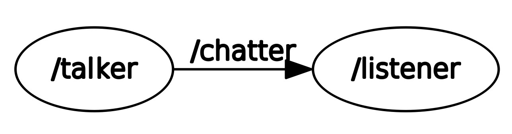

[](https://opensource.org/licenses/BSD-3-Clause)

<h1>ROS Beginner Tutorial - Publisher and Subscriber </h1>

</p>
<p align="center">

</p>

</p>
<p align="center">
Reference for image: <a href='http://www.ros.org/'>link</a>
</p>

## Project Overview
The project covers creating publisher and subscriber in ROS. It has two following nodes:
* Publisher node - talker.cpp
* Subscriber node - listener.cpp

Publisher node publishes a custom string message on the chatter topic. The Subscriber node subscribes the topic and display the string message published by the talker. Both publisher and subscriber nodes are written in C++ language.

## Dependencies

These ROS nodes are made to be used on systems which have:
* ROS Kinetic
* Ubuntu 16.04

To install ROS, follow the instructions on this [link](http://wiki.ros.org/kinetic/Installation)

## Build Instructions
#### Build Catkin Workspace
Open terminal and run the following command to clone this repository in it
```
$ git clone --recursive https://github.com/krawal19/beginner_tutorials.git catkin_ws/src/beginner_tutorials
$ cd catkin_ws
```
#### Build the package
Use the below command to build the ROS package
```
$ catkin_make
```
## Running Instructions
To start roscore, open a new terminal window and run following command
```
$ source /opt/ros/kinetic/setup.bash
$ roscore
```
To run talker node, open a new terminal window and run following command
```
$ cd <path to catkin_ws>
$ source devel/setup.bash
$ rosrun beginner_tutorials talker
```
To run listener node, open a new terminal window and run following command
```
$ cd <path to catkin_ws>
$ source devel/setup.bash
$ rosrun beginner_tutorials listener
```
## Graphical visualization of ROS Nodes
Open a new terminal and run following command
```
$ rqt_graph
```
<p align="center">

</p>

