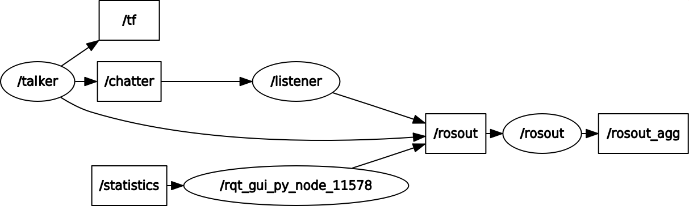

[](https://opensource.org/licenses/BSD-3-Clause)

<h1>ROS Beginner Tutorial - Publisher and Subscriber </h1>

</p>
<p align="center">

</p>

</p>
<p align="center">
Reference for image: <a href='http://www.ros.org/'>link</a>
</p>

## Project Overview
The project covers creating publisher and subscriber in ROS. It has two following nodes:
* Publisher node - talker.cpp
* Subscriber node - listener.cpp

Publisher node publishes a custom string message on the chatter topic. The Subscriber node subscribes the topic and display the string message published by the talker. Both publisher and subscriber nodes are written in C++ language.

## Dependencies

These ROS nodes are made to be used on systems which have:
* ROS Kinetic
* Ubuntu 16.04

To install ROS, follow the instructions on this [link](http://wiki.ros.org/kinetic/Installation)

## Build Instructions
#### Build Catkin Workspace
Open terminal and run the following command to clone this repository in it
```
$ git clone -b Week11_HW https://github.com/krawal19/beginner_tutorials.git catkin_ws/src/beginner_tutorials
$ cd catkin_ws
```
#### Build the package
Use the below command to build the ROS package
```
$ catkin_make
```
## Running Instructions

To run code using launch command, open a new terminal window and run following command
```
$ cd <path to catkin_ws>
$ source devel/setup.bash
$ roslaunch beginner_tutorials launchFile.launch
```
To run the launch command using arguments
```
$ cd <path to catkin_ws>
$ source devel/setup.bash
$ roslaunch beginner_tutorials launchFile.launch result:=passed
```
To run each node separately using roscore , open a new terminal window and run following command
```
$ source /opt/ros/kinetic/setup.bash
$ roscore
```
Then to run talker node, open a new terminal window and run following command
```
$ cd <path to catkin_ws>
$ source devel/setup.bash
$ rosrun beginner_tutorials talker <Enter passed or failed>
```
Then to run listener node, open a new terminal window and run following command
```
$ cd <path to catkin_ws>
$ source devel/setup.bash
$ rosrun beginner_tutorials listener
```
## Service
To run talker node service, type the following in a new terminal after starting roscore and talker node from the methods mentioned above.
After running the command the publisher message will change as mentioned in input string.
```
$ source devel/setup.bash
$ rosservice call /serviceFile Igotpassed
```
## TF frames
While the above process is running use the below command to inspect TF frames /talk and / world. Talker node broadcast tf transform to talk frame with world frame as parent. Here tf_echo reports the transform between any two frames broadcast over ROS.
```
$ rosrun tf tf_echo /world /talk
```
Running the above command will give the similar output as shown below
```
At time 1542158681.347
- Translation: [-1.413, 0.061, 0.000]
- Rotation: in Quaternion [0.000, 0.000, 0.932, -0.363]
            in RPY (radian) [0.000, -0.000, -2.399]
            in RPY (degree) [0.000, -0.000, -137.479]
At time 1542158681.947
- Translation: [1.181, 0.779, 0.000]
- Rotation: in Quaternion [0.000, 0.000, 0.632, 0.775]
            in RPY (radian) [0.000, -0.000, 1.368]
            in RPY (degree) [0.000, -0.000, 78.408]
At time 1542158682.947
- Translation: [1.183, 0.775, 0.000]
- Rotation: in Quaternion [0.000, 0.000, 0.631, 0.776]
            in RPY (radian) [0.000, -0.000, 1.365]
            in RPY (degree) [0.000, -0.000, 78.230]
```
To visualize frames we use the below command in new terminal.
Use the below command to visualize frames using rqt
```
$ cd <path to repository>/catkin_ws
$ source devel/setup.bash
$ rosrun rqt_tf_tree rqt_tf_tree
```
Or to generate a pdf for visulisation use below command
```
$ cd <path to repository>/results
$ rosrun tf view_frames
```
To view the tree pdf
```
$ cd <path to repository>/results
$ evince frames.pdf
```
view_frames creates a diagram of the frames being broadcast by tf over ROS. Here we can see the two frames /world and /talk that are broadcast by the tf. In addition to this diagnostic information is also available such as oldest and most recent frame transforms time and also the rate of tf frame publishing.

## rostest
The Level 2 integration test is written using gtest and rostest. Close all the running processes before executing the commands below to run the rostest.
```
$ cd <path to catkin Workspace>
$ source devel/setup.bash
$ catkin_make run_tests_beginner_tutorials
```
Or test using launch file
```
$ cd <path to catkin Workspace>
$ source devel/setup.bash
$ rostest beginner_tutorials testTalk.launch
```
By running command the above command output will be as shown below
```
[Testcase: testtestTalk] ... ok

[ROSTEST]-----------------------------------------------------------------------

[beginner_tutorials.rosunit-testTalk/change][passed]
[beginner_tutorials.rosunit-testTalk/testChangeTestService][passed]

SUMMARY
 * RESULT: SUCCESS
 * TESTS: 2
 * ERRORS: 0
 * FAILURES: 0

rostest log file is in /home/kapil/.ros/log/rostest-kapil-11139.log
```
## Recording rosbag file
To record a bag file with the contents of specified topics using launch command. Follow the command given below. Here the bag file will be stored in the results folder.
```
$ roslaunch beginner_tutorials launchFile.launch record:=true
```
To view the summary of the contents in the bag file, use the command below
```
$ cd <path to repository>/results
$ rosbag info bagDataFile.bag
```
Note:Data of ~15 seconds is recorded using the above command.

## Playing rosbag file
Before running the previous recorded bag file close all the existing running processes and Run roscore and listener node by using the methods above. Then follow the commands below
```
$ cd <path to repository>/results
$ rosbag play bagDataFile.bag
```
After running the above command listener node will show the output of the data recorded in bag file.

## Logging
To visualise logger messages in Qt-based framework, run the commands below after running roscore and nodes as mentioned above
```
$ rosrun rqt_console rqt_console
```

## Graphical visualization of ROS Nodes
Open a new terminal and run following command
```
$ rqt_graph
```
<p align="center">

</p>
